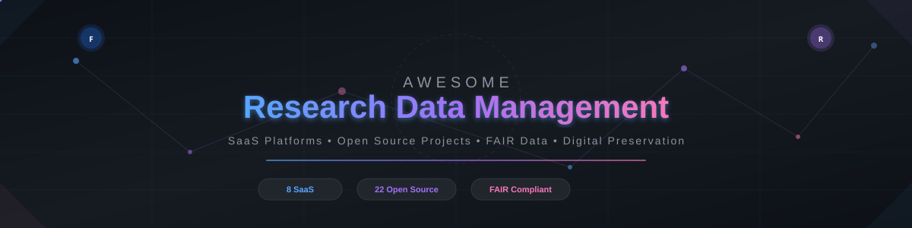

  

# Awesome Research Data Management 📊

    

> **Curated list of the best SaaS platforms and open-source GitHub projects for Research Data Management (RDM), FAIR data, data preservation, and open science infrastructure.**

*Keywords: research data management, RDM, FAIR data, data repository, data management plan, DMP, open science, metadata, digital preservation, institutional repository, research information management, CRIS, scholarly data, open access, reproducible research.*

**Last updated: September 2026**

---

## 🔬 What is Research Data Management?

Research Data Management (RDM) encompasses the policies, practices, and tools used to handle research data throughout its lifecycle — from creation and collection to storage, preservation, sharing, and reuse. Effective RDM ensures data follows [FAIR principles](https://www.go-fair.org/fair-principles/) (Findable, Accessible, Interoperable, Reusable) and meets funder mandates from agencies like NIH, NSF, ERC, and UKRI.

This repository tracks notable **SaaS/hosted platforms** and **open-source projects** for:

- 🗄️ **Data Repositories & Archives** — Store, share, and cite research outputs with DOIs
- 📋 **Data Management Plans (DMPs)** — Create funder-compliant DMPs and data sharing plans
- 🏛️ **Research Information Management (CRIS)** — Track publications, grants, and research impact
- 🏷️ **Metadata & Standards** — Author, validate, and publish FAIR-compliant metadata
- 🛡️ **Digital Preservation** — Ensure long-term access to research data and digital objects
- 🔄 **Reproducible Research** — Version control, containerized workflows, and data lineage
- 📓 **Electronic Lab Notebooks (ELN)** — Capture experiments and protocols digitally
- **Electronic Lab Notebooks (ELN)** — Capture experiments and protocols digitally

### 🏆 Category Leaders

Figshare, Dryad, Dataverse, Open Science Framework (OSF), Zenodo, DSpace, CKAN, Symplectic Elements, Pure, Converis, LabKey, and DMPTool are the category leaders across these domains.

### 🌐 Open-Source Emphasis

Research Data Management has one of the strongest open-source ecosystems of any domain. **Dataverse**, **InvenioRDM** (the software behind Zenodo), **Open Science Framework**, **CKAN**, **DSpace**, **OpenRefine**, **DVC**, and related projects power many institutional and national repositories worldwide.

---

Contributions welcome! Open a PR to add/update entries. Keep descriptions factual and link to official sites.

## Table of Contents

- [🔬 What is Research Data Management?](#what-is-research-data-management)
- [☁️ SaaS/Hosted Platforms](#saas-hosted-platforms)
- [🐙 Open-Source GitHub Projects](#open-source-github-projects)
- [🛠️ Related Resources](#related-resources)
- [🤝 How to Contribute](#how-to-contribute)
- [⚠️ Disclaimer](#disclaimer)
- [📈 Star History](#-star-history)

## ☁️ SaaS/Hosted Platforms

**Market Context**: The Research Data Management and repository sector is estimated at **$2–3 billion annually** (2025–2026), encompassing institutional CRIS platforms, generalist data repositories, DMP tools, and enterprise research information systems. The sector is **moderately fragmented** — a few large incumbents (Elsevier/RELX, Springer Nature, Digital Science) dominate the CRIS/institutional segment, while the generalist repository space has many players (Figshare, Dryad, Zenodo, OSF) with no single winner-take-all dynamic. Open-source projects like Dataverse, DSpace, and CKAN ensure no vendor can fully lock in the market. The sector is expected to grow at ~8–12% CAGR driven by mandates for FAIR data and open science from funders like NIH, NSF, and the European Commission.

| Product | Parent Company | Revenue / Market Cap | Starting Price | Free Tier / Trial Limit |
|---------|---------------|---------------------|----------------|------------------------|
| [**Pure**](https://www.elsevier.com/products/pure) | [Elsevier (RELX)](https://www.relx.com/) | **Revenue ~$3.9B/yr** (Elsevier); RELX market cap **~$60B** | Custom (enterprise institutional license, typically $50K–$200K+/yr) | No free tier; no public trial — demo available on request |
| [**Figshare**](https://figshare.com/) | [Digital Science (Holtzbrinck)](https://www.digital-science.com/) | **Revenue ~$165M** (Digital Science); parent Holtzbrinck **~$1.2B rev** | **$875** one-time for 250 GB (Figshare+); institutional plans available | **20 GB** storage free forever; max 20 GB per individual file |
| [**Symplectic Elements**](https://www.symplectic.co.uk/) | [Digital Science (Holtzbrinck)](https://www.digital-science.com/) | **Revenue ~$165M** (Digital Science); parent Holtzbrinck **~$1.2B rev** | Custom (enterprise institutional license, typically $30K–$150K+/yr) | No free tier — institutional license only |
| [**LabKey**](https://www.labkey.com/) | LabKey Software (private) | **~$7M revenue**; ~36 employees | **$6,540/yr** (LIMS Starter, 5 users) to **$59,400/yr** (LIMS Enterprise, 10 users) | No free tier; **free trial available** on request |
| [**Dryad**](https://datadryad.org/) | Dryad (501(c)(3) nonprofit) | **~$3–5M/yr revenue** (nonprofit) | **$150** per dataset (≤5 GB), scaling to $808 (≤100 GB), $1,528 (≤250 GB) | No free tier — fee waiver available for low-income countries (World Bank classification); institutional partners may pre-pay DPCs |
| [**Zenodo**](https://zenodo.org/) | CERN (intergovernmental org) | Funded by CERN & EU OpenAIRE (~**€1.2B** CERN annual budget share) | **Free** for researchers (no paid tier) | **Free forever** — 50 GB per record, up to 100 files per record; no cap on total deposits; larger quotas on request |
| [**Open Science Framework (OSF)**](https://osf.io/) | [Center for Open Science](https://www.cos.io/) (501(c)(3) nonprofit) | **$10.2M revenue** (FY2024, mostly grants) | **Free** for researchers (no paid tier) | **Free forever** — 5 GB per private project, 50 GB per public project; unlimited components per project |
| [**DMPTool**](https://dmptool.org/) | [California Digital Library](https://cdlib.org/) (UC system) | Part of UC/CDL budget (**~$400M+** CDL annual) | **Free** for all users (no paid tier) | **Free forever** — unlimited DMPs, no storage limits (planning tool, not a data repository) |

## 🐙 Open-Source GitHub Projects

The open-source RDM ecosystem is extensive. Projects are sorted by GitHub_Stars (descending).

| Project | Stars | Description | Primary Use Case | License |
|---------|-------|-------------|-----------------|---------|
| [**DVC (Data Version Control)**](https://dvc.org/)  | 14k+ | Open-source version control system for ML/data science projects. Manages large files, datasets, and ML models using Git-like semantics with cloud storage backends. | Data & ML model versioning | Apache-2.0 |
| [**DataHub**](https://datahubproject.io/)  | 11k+ | Metadata platform originally from LinkedIn for data discovery, governance, and observability. Tracks lineage, integrates with dbt, Airflow, and Spark. | Metadata management & data discovery | Apache-2.0 |
| [**OpenRefine**](https://github.com/openrefine/openrefine)  | 10k+ | Java-based power tool for cleaning, transforming, and reconciling messy tabular data. Widely used for metadata cleanup, name reconciliation, and data preparation in RDM workflows. | Data cleaning & reconciliation | BSD-3-Clause |
| [**OpenMetadata**](https://open-metadata.org/)  | 8k+ | Open-source metadata platform for data cataloging, governance, and observability. Supports lineage, data quality, and ML metadata management. | Metadata management & data catalog | Apache-2.0 |
| [**CKAN**](https://github.com/ckan/ckan)  | 4.3k+ | Widely used open-source data portal and catalog software, frequently adopted for research data catalogues, governmental open data, and institutional data discovery. | Data catalog / portal | AGPL-3.0 |
| [**cBioPortal**](https://www.cbioportal.org/)  | 2.5k+ | Visualization, analysis, and download of large-scale cancer genomics data sets. Over 200 published cancer studies with mutation, expression, and clinical data. | Cancer genomics data portal | AGPL-3.0 |
| [**eLabFTW**](https://www.elabftw.net/)  | 2k+ | Open-source electronic lab notebook for research teams. Stores and organizes experiments, protocols, and lab notes with full-text search and ELN capabilities. | Electronic lab notebook (ELN) | AGPL-3.0 |
| [**Frictionless Data**](https://frictionlessdata.io/)  | 2k+ | Lightweight specifications and Python/JS/R tooling for data validation, extraction, and transformation. Provides Data Package and Table Schema standards for FAIR data. | Data packaging & validation standards | MIT |
| [**Amundsen**](https://www.amundsen.io/)  | 2k+ | Data discovery and metadata engine originally from Lyft. Helps users discover and trust data through a searchable metadata catalog. | Data discovery engine | Apache-2.0 |
| [**Open Science Framework (OSF)**](https://github.com/CenterForOpenScience/osf.io)  | 1.5k+ | Open-source platform for the entire research lifecycle — project management, collaboration, versioning, pre-registration, and data sharing — developed by the Center for Open Science. | Research lifecycle & preregistration | MIT |
| [**DSpace**](https://github.com/DSpace/DSpace)  | 1.2k+ | Long-established open-source repository software used by libraries and institutions for publications, theses, and increasingly for research data. | Institutional repository | Apache-2.0 |
| [**Dataverse**](https://github.com/IQSS/dataverse)  | 900+ | Leading open-source research data repository software developed at Harvard's IQSS. Supports sharing, citing, preserving, and discovering research data with a flexible, multi-level "Dataverse" collection model. Widely deployed by universities and consortia. | Institutional data repository | Apache-2.0 |
| [**InvenioRDM**](https://inveniosoftware.org/products/rdm/)  | 700+ | Turn-key open-source research data management repository platform built on the Invenio Framework. Zenodo is the flagship public instance; institutions can run their own InvenioRDM repositories. | Generalist / institutional repository | MIT |
| [**REDCap**](https://project-redcap.org/)  | 500+ | Secure web application for building and managing online surveys and databases for clinical research. Used by 6,000+ institutions in 160+ countries. Source available but not fully open-source license. | Clinical research data capture | non-commercial license |
| [**OpenNeuro**](https://openneuro.org/)  | 400+ | Free, open platform for sharing neuroimaging data (MRI, MEG, EEG, PET) formatted to the Brain Imaging Data Structure (BIDS) standard. BRAIN Initiative designated archive. | Neuroimaging data sharing | MIT |
| [**Archivematica**](https://www.archivematica.org/)  | 350+ | Open-source digital preservation system implementing ISO 16363 (Trusted Digital Repository). Manages ingest, processing, and storage of AIPs/DIPs for long-term access. | Digital preservation | AGPL-3.0 |
| [**Renku**](https://renku.io/)  | 250+ | Collaborative platform for reproducible and reusable data science. Built on knowledge graphs, Git, and containers to link code, data, and narrative for research workflows. | Reproducible research workflows | Apache-2.0 |
| [**Samvera / Hyrax**](https://samvera.org/)  | 200+ | Community-developed repository framework (Ruby on Rails + Fedora) powering institutional data repositories like Deep Blue Data (U Michigan) and Imago (Indiana). | Institutional repository | Apache-2.0 |
| [**iRODS**](https://irods.org/)  | 100+ | Integrated Rule-Oriented Data System — policy-based data management middleware for large-scale, distributed storage environments. Used by national labs and research computing centers. | Policy-based distributed data mgmt | BSD-3-Clause |
| [**Fedora Repository**](https://fedorarepository.org/)  | 150+ | Flexible, extensible, open-source digital repository platform often paired with Samvera/Hyrax for institutional repository infrastructure. Supports linked data and scholarly objects. | Digital repository infrastructure | MIT |
| [**CEDAR Metadata Tool**](https://github.com/metadatacenter)  | 60+ | Metadata schema authoring and template management platform developed by Stanford. Generates high-quality metadata conforming to community standards for FAIR data. | Metadata authoring | BSD-2-Clause |
| [**REANA**](https://reanahub.io/)  | 150+ | Reusable and reproducible research data analysis platform from CERN. Structures input data, analysis code, and containerised workflows for reproducibility. | Reproducible analysis platform | MIT |

### 🛠️ Related Open Metadata & Standards Tooling

- **Metadata & standards**: [CEDAR](https://github.com/metadatacenter), [schema.org](https://schema.org/), [DataCite](https://datacite.org/), [Dublin Core](https://www.dublincore.org/), and related open metadata tooling.
- **FAIR assessment**: Community tools that evaluate datasets against FAIR principles.
- **Lab / ELN integration**: Open electronic lab notebooks and connectors that feed data into repositories.
- **Preservation systems**: [Archivematica](https://www.archivematica.org/) and similar open digital-preservation pipelines often paired with repositories.
- **Search & discovery**: Elasticsearch/OpenSearch-based discovery layers used by Invenio, Dataverse, and CKAN.
- National and institutional deployments of Dataverse, InvenioRDM, or CKAN as the core of a research data service.

---

### 🧩 Frameworks for building custom systems

The strongest open-source foundations are **Dataverse** (especially for institutional data repositories) and **InvenioRDM** (for Zenodo-style generalist or institutional repositories).  
**OSF** provides an open platform for project-centric research workflows.  
**CKAN** and **DSpace** remain excellent for catalogs and hybrid publication/data repositories.  
**Samvera/Hyrax + Fedora** is a powerful stack for institutions wanting a Ruby-based, highly customizable repository.  
These can be combined with open metadata tools, preservation systems, and authentication infrastructure.  

Hosted services (Figshare, Dryad, Zenodo.org, OSF.io, LabKey Cloud, commercial CRIS platforms) offer convenience, curation, and support. Many institutions run self-hosted Dataverse or InvenioRDM instances while also recommending Zenodo or domain repositories to their researchers.

## 🤝 How to Contribute

1. Fork the repo.
2. Add/edit entries in `README.md` (follow existing format).
3. Include: name, link, 1–2 sentence description, and whether it's SaaS/hosted or open-source.
4. Submit PR with a short explanation.

⭐ Star the repo if you find it useful!

## ⚠️ Disclaimer

- This is a **community-curated** list — not exhaustive and not an endorsement.
- Research data often includes sensitive, personal, or proprietary information. Access controls, consent, licensing, and long-term preservation planning are essential.
- Open-source RDM platforms provide transparency, community governance, and freedom from vendor lock-in, but still require institutional commitment to hosting, curation, and sustainability. Evaluate governance, funding, and support models carefully.

---

## 📈 Star History

---

**Made for research data stewards, librarians, research software engineers, open-science advocates, and institutional research offices.**  
Let's strengthen the global open infrastructure for research data so that knowledge remains findable, accessible, interoperable, and reusable. 🚀
